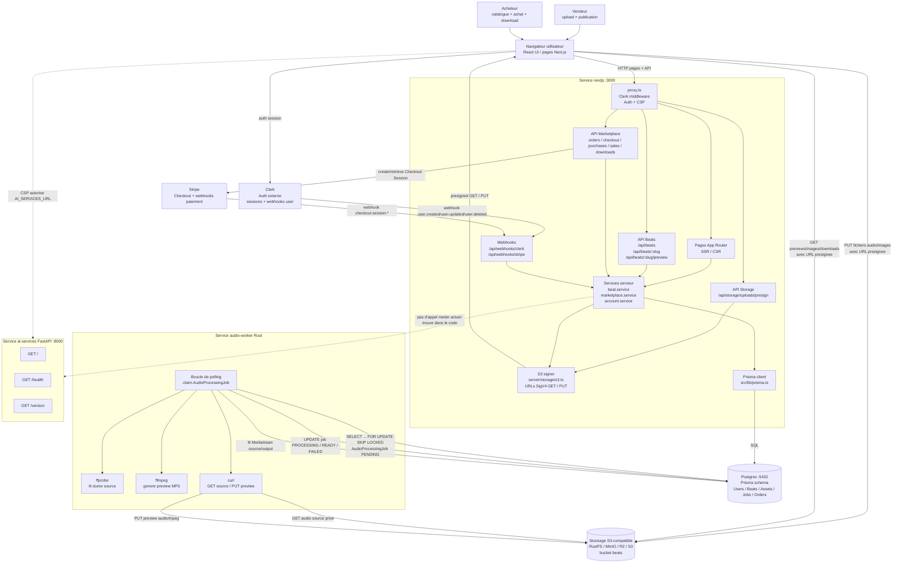
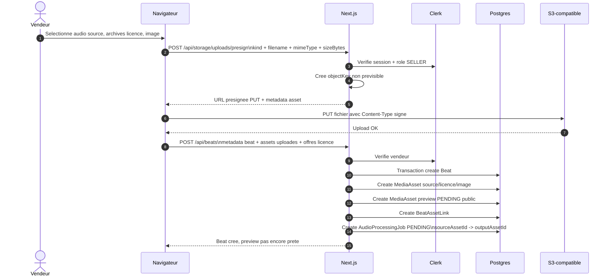
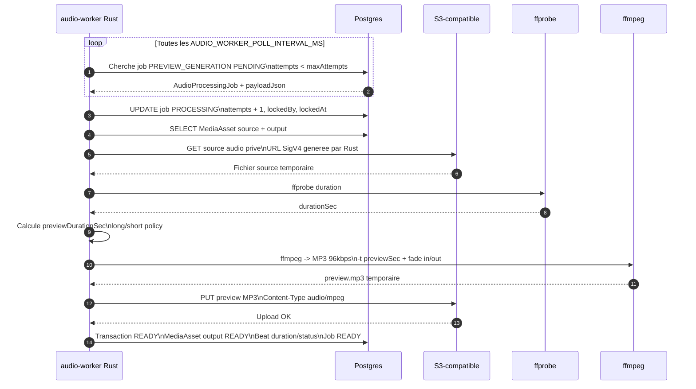
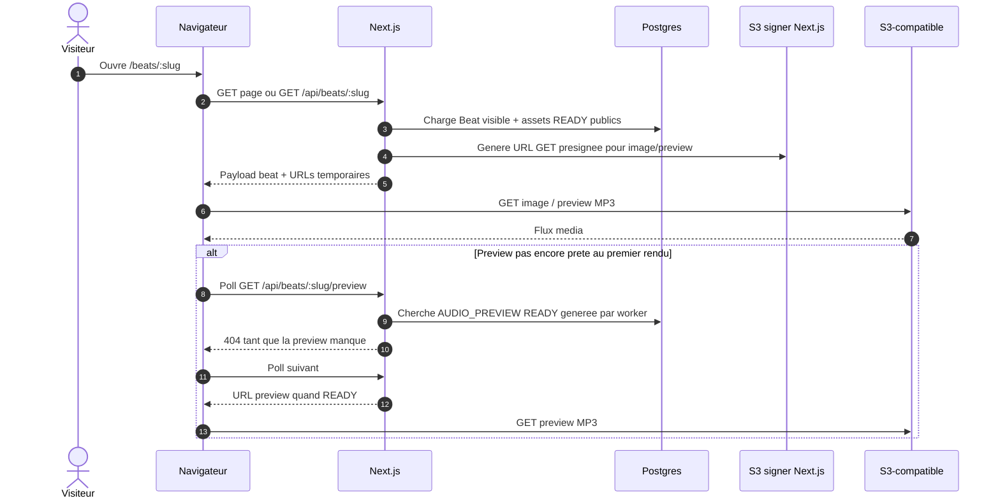
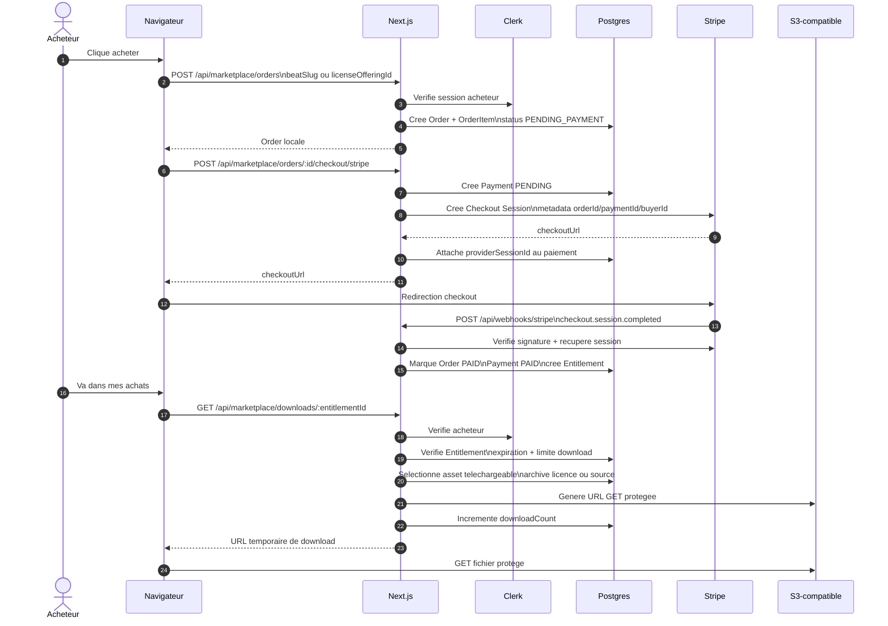
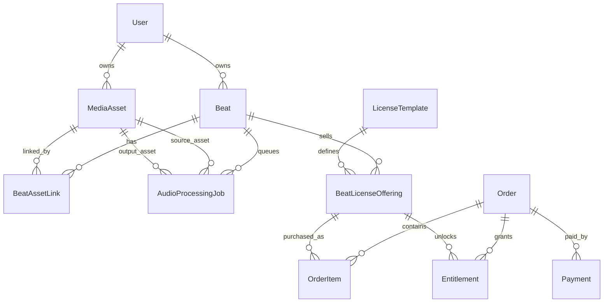

# Universe

Marketplace musical pour publier, vendre, acheter et telecharger des beats. Le projet combine une
application Next.js, un worker Rust pour le traitement audio, une API FastAPI reservee aux services
IA futurs, Postgres comme source de verite metier, et un stockage S3-compatible pour les assets.

## Architecture globale de l'application

Point cle : `nextjs` ne communique pas directement avec le worker Rust par HTTP. La liaison se fait
par la base Postgres et le stockage S3-compatible :

- Next.js cree les lignes metier, les assets et les jobs dans Postgres.
- Next.js donne au navigateur des URLs S3 presignees pour uploader ou lire les fichiers.
- Le worker Rust surveille Postgres, prend les jobs `PENDING`, lit/ecrit dans S3, puis met a jour
  Postgres.
- Le navigateur repasse par Next.js pour savoir si la preview est prete.

### Schema Mermaid principal

### Flux 1 : upload vendeur et creation d'un beat

### Flux 2 : generation automatique de preview par Rust

### Flux 3 : lecture publique d'une preview

### Flux 4 : achat Stripe et telechargement protege

### Relations de donnees principales

### Lecture rapide des liaisons

| Liaison | Type | Role |
| --- | --- | --- |
| Navigateur -> Next.js | HTTP pages/API | UI, catalogue, publication, achat, compte |
| Next.js -> Clerk | SDK serveur + webhooks | Authentification, roles, synchro comptes |
| Next.js -> Postgres | Prisma | Source de verite metier |
| Next.js -> S3 | Signature seulement | Genere des URLs temporaires GET/PUT |
| Navigateur -> S3 | HTTP direct | Upload fichiers et lecture media sans proxy Next.js |
| Next.js -> audio-worker | Indirect via Postgres | Creation de jobs `AudioProcessingJob` |
| audio-worker -> Postgres | SQLx | Claim jobs, lit assets, met a jour status |
| audio-worker -> S3 | URLs SigV4 + curl | Telecharge source, upload preview |
| audio-worker -> ffprobe/ffmpeg | Process local | Analyse et encode l'audio |
| Next.js -> Stripe | SDK serveur | Checkout, verification paiement |
| Stripe -> Next.js | Webhook | Fulfillment commandes et paiements |
| Next.js / navigateur -> ai-services | Prevu / expose | Service FastAPI disponible, pas encore de flux metier detecte |

## Repertoires principaux

| Dossier | Role |
| --- | --- |
| `app` | Application Next.js, UI, API routes, Prisma, logique marketplace |
| `audio-worker` | Worker Rust de generation de previews audio |
| `ai-services` | Service FastAPI pour endpoints IA/scoring futurs |
| `infra` | Docker Compose, environnements et documentation infra |
| `docs` | Documentation produit et metier |
